# Workshop - People Counter using the Arduino Portenta and LoRaWAN (TheThingsNetwork)

*This workshop has been prepared for TheThingConference 2022.*

In this tutorial, you will learn how to build a people counter using the Arduino Portenta H7's camera and send the inference results over LoRaWan.

Here is the list of tools and material used for this workshop:

Hardware:

- [Arduino Portenta H7](https://store.arduino.cc/products/portenta-h7) 
- [Arduino Portenta Vision Shield - LoRa®](https://store.arduino.cc/products/arduino-portenta-vision-shield-lora%C2%AE_).
- TTN gateway (optional) only if you are located in an area not covered by TheThingsNetwork. Adding your gateway to TheThingsNetwork won't be seen in this tutorial.

Tools:

- [Edge Impulse Studio](https://studio.edgeimpulse.com/) to build your machine learning model.
- [TheThingsNetwork](https://id.thethingsnetwork.org/oidc/interaction/RUzIMCWvQDPOM-7-6aZYX) to retrieve your inference results.
- [Arduino IDE](https://www.arduino.cc/en/software) to update the firmware on the LoRa® modem (Arduino released Arduino IDE 2.0.0 on Sept 14, this tutorial has been tested with Arduino IDE 1.18).
- [OpenMV IDE](https://openmv.io/pages/download) to write the custom embedded firmware for the Portenta H7 (optional all can be done using Arduino IDE)


## Build your machine learning model

For this project, we are using [Edge Impulse FOMO](https://docs.edgeimpulse.com/docs/edge-impulse-studio/learning-blocks/object-detection/fomo-object-detection-for-constrained-devices) (Faster Objects, More Objects). It is a novel machine-learning algorithm that brings object detection to highly constrained devices. It lets you count objects, find the location of objects in an image, and track multiple objects in real-time using up to 30x less processing power and memory than MobileNet SSD or YOLOv5.

This means FOMO models will run very fast even on an Arduino Portenta. However, it removes one of the useful advantages of MobileNet SSD of YOLOv5 which are the bounding boxes.

FOMO is trained on centroid, thus will provide only the location of the objects and not their size.

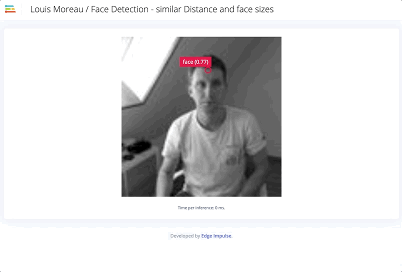

As you can see in the animation above, the portion the face is taking in the frame is very different depending on how close we are to the camera. This sounds logical but it can bring one complexity to the end application. We would need to place the camera where the people will mostly be at a similar distance. Here we have optimized the model to work in its **ideal condition if the subjects are placed between 1.5 and 2 meters away from the camera**.

But do not worry if you have different parameters, Edge Impulse has been built so you can create your custom machine learning models. Just collect another dataset, more suitable for your use case and retrain your model.

If you have more processing power, you can also use MobileNet SSD pre-trained models to train your custom machine learning models. Those will provide bounding boxes around the person:


Now that you understood the concept, we can create our custom machine learning model.

### Setup your Edge Impulse project

If you do not have an Edge Impulse account yet, start by creating an account on [Edge Impulse Studio]((https://studio.edgeimpulse.com/)) and create a project.

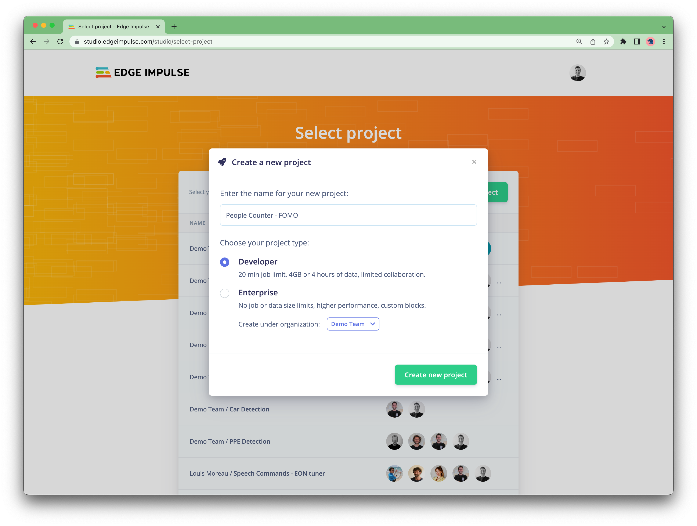

You will see a helper to help you set up your project type.
Select **Images -> Classify multiple objects (object detection) -> Let's get started**

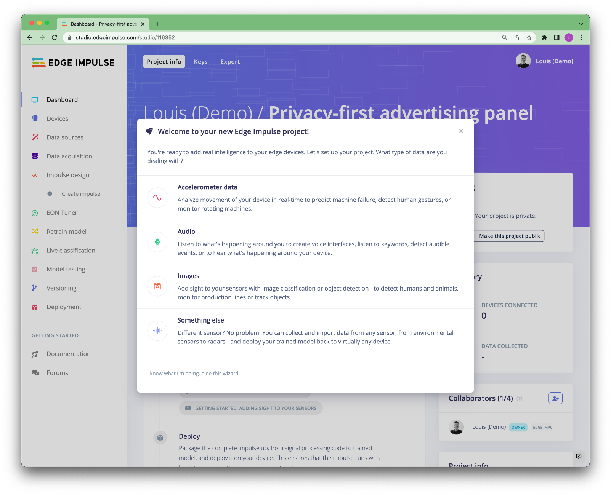

That's it now your project is set up and we can start collecting images.

### Collect your dataset

As said before, for this project to work in its nominal behavior, the faces have to be between 1.5 and 2 meters away from the camera. So let's start collecting our dataset. To do so, navigate to the **Data acquisition** page.

We provide several options to collect images, please have a look at [Edge Impulse documentation website](https://docs.edgeimpulse.com/docs/edge-impulse-studio/data-acquisition).

We have used the mobile phone option. Click on **Show options**:

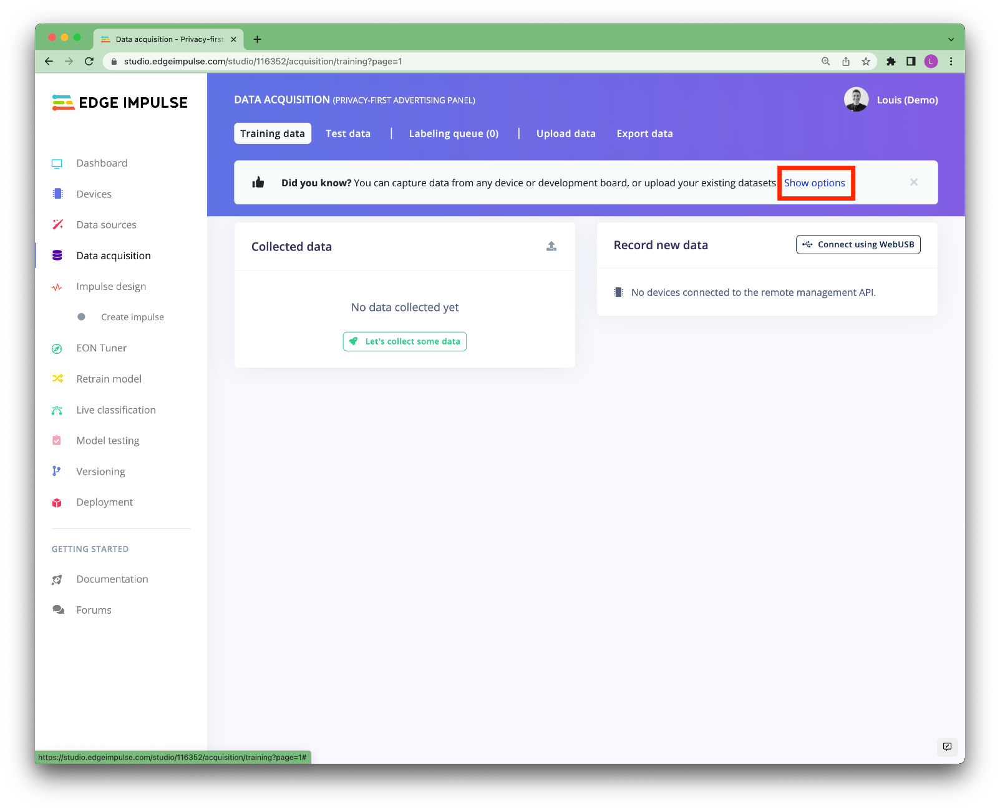

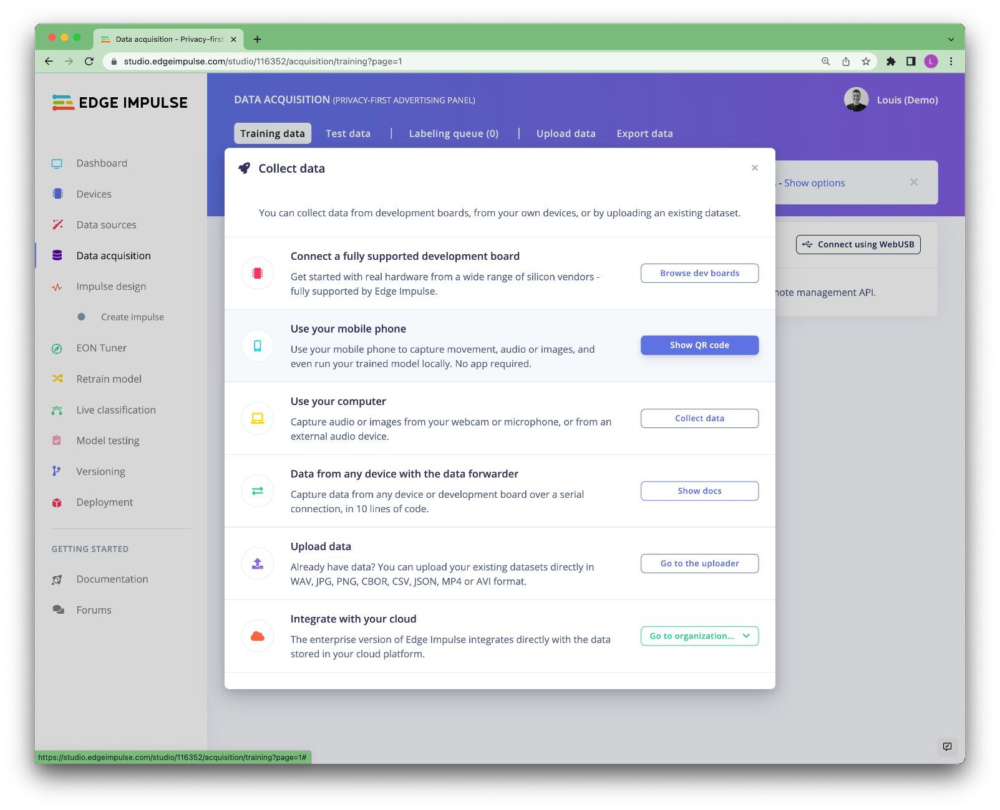

Flash the QR Code with your mobile phone and start collecting data.

*Ideally, you want your pictures to be as close as the production environment. For example, if you intend to place your advertising screen in a mall, try to collect the pictures at the same place where your screen will be. This is not always possible for an application that will be deployed in unknown places, in that case, try to keep diversity in the images you will collect. You will probably need more data to obtain a good accuracy but your model will be more general.*

Collect about 100 images and make sure you **split** your samples between your **training set** and your **testing set**. We will use this test dataset to validate our model later. To do so, click on **Perform a train/test split** under the **Dashboard** view.

Go back to the **Data acquisition** view and click on the **Labeling queue**.

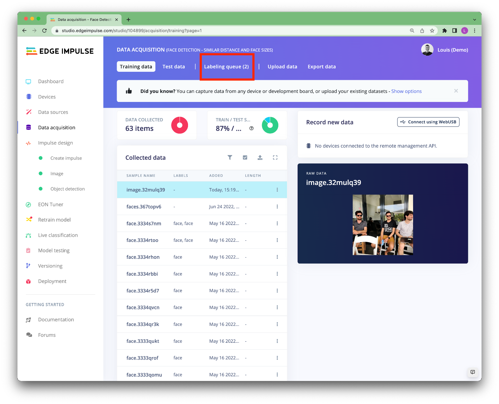

This will open a new page where you can manually draw bounding boxes around the faces:

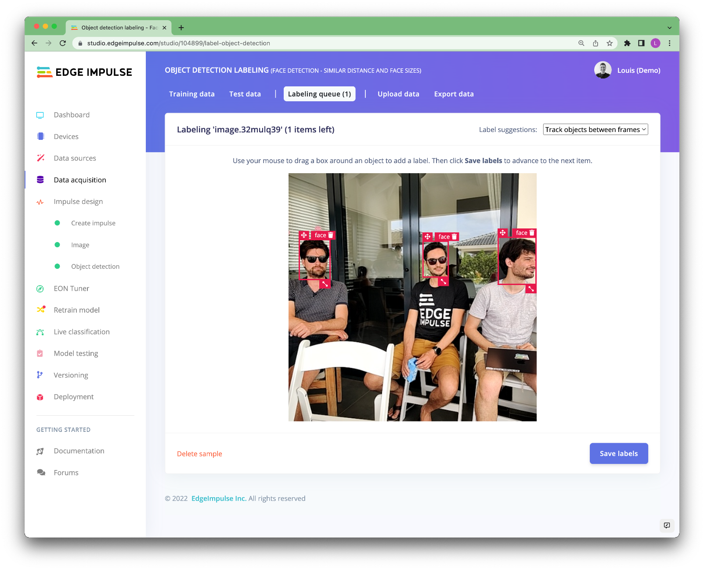

*This process can be tedious, however, having a good dataset will help in reaching a good accuracy.*

>For advanced users, if you want to upload data that already contains bounding boxes, the [uploader](https://docs.edgeimpulse.com/docs/edge-impulse-studio/data-acquisition/uploader) can label the data for you as it uploads it. In order to do this, all you need is to create a bounding_boxes.labels file in the same folder as your image files. The contents of this file are formatted as JSON with the following structure:

```
{
    "version": 1,
    "type": "bounding-box-labels",
    "boundingBoxes": {
        "mypicture.jpg": [{
            "label": "face",
            "x": 119,
            "y": 64,
            "width": 206,
            "height": 291
        }, {
            "label": "face",
            "x": 377,
            "y": 270,
            "width": 158,
            "height": 165
        }]
    }
}
```

Once all your data has been labeled, you can navigate to the **Create Impulse tab**

### Create your machine learning pipeline

After collecting data for your project, you can now create your Impulse. A complete Impulse will consist of 3 main building blocks: an input block, a processing block, and a learning block.

**Here you will define your own machine learning pipeline.**

One of the beauties of FOMO is its fully convolutional nature, which means that just the ratio is set. Thus, it gives you more flexibility in its usage compared to the classical Object detection method. For this tutorial, we have been using **96x96 images** but it will accept other resolutions as long as the images are square.
To configure this, go to Create impulse, set the image width and image height to '**96**', the resize mode to '**Fit the shortest axis**' and, add the '**Images**' and '**Object Detection (Images)**' blocks. Then click Save impulse.

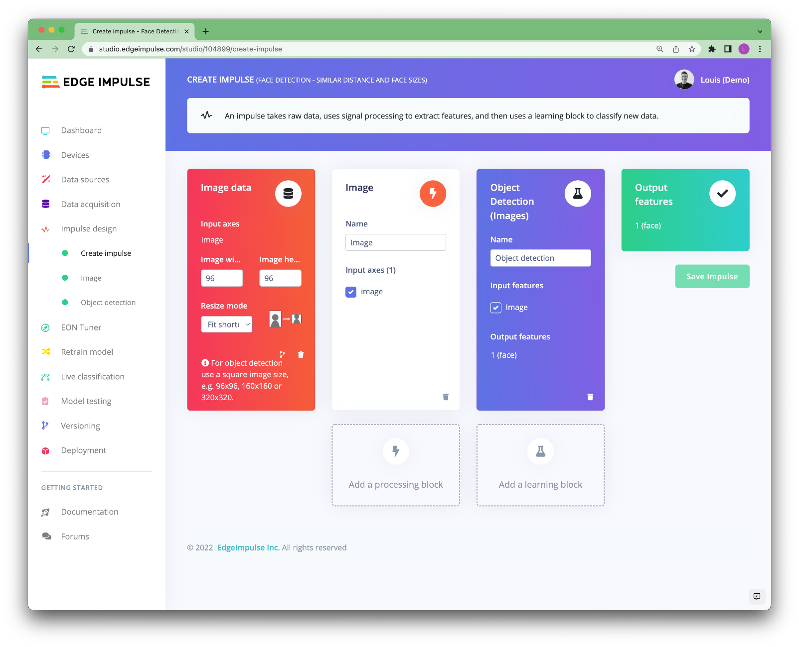

### Pre-process your images

Generating features is an important step in Embedded Machine Learning. It will create features that are meaningful for the Neural Network to learn on instead of learning directly from the raw data.

To configure your processing block, click **Images** in the menu on the left. This will show you the raw data on top of the screen (you can select other files via the drop-down menu), and the results of the processing step on the right. You can use the options to switch between 'RGB' and 'Grayscale' modes. Then click **Save parameters**.

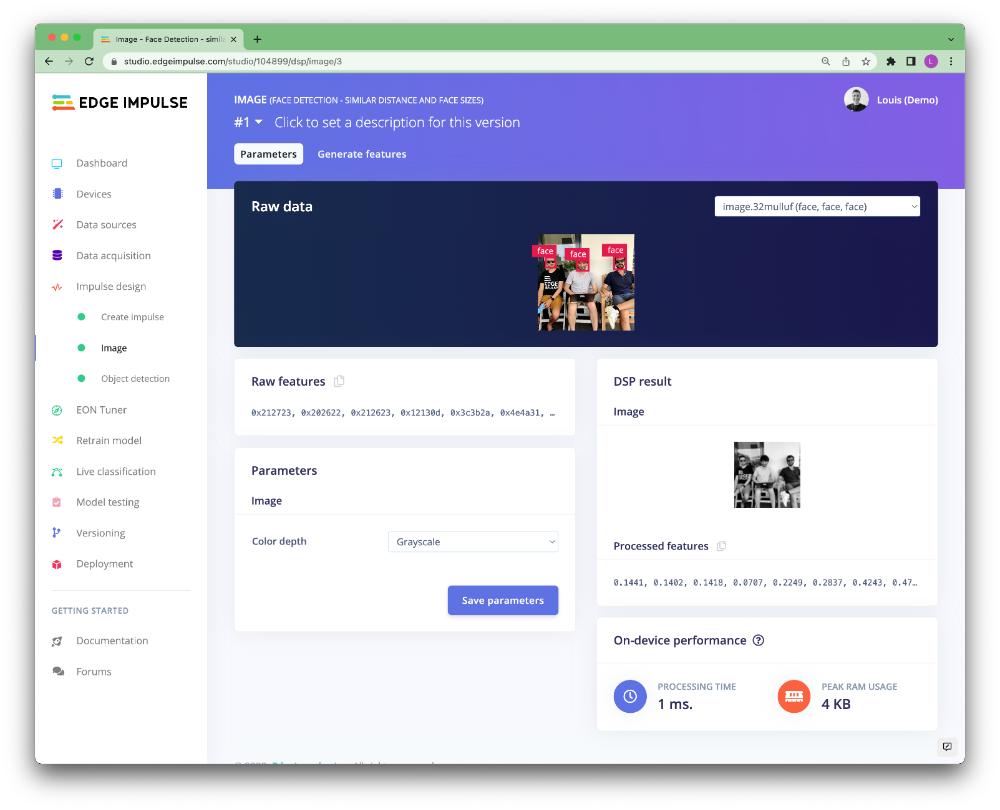

This will send you to the 'Feature generation' screen that will:

- Resize all the data.
- Apply the processing block on all this data.
- Create a 2D visualization of your complete dataset.

Click **Generate features** to start the process.

### Train your model using FOMO

With all data processed it's time to start training our FOMO model. The model will take an image as input and output the objects detected using centroids.

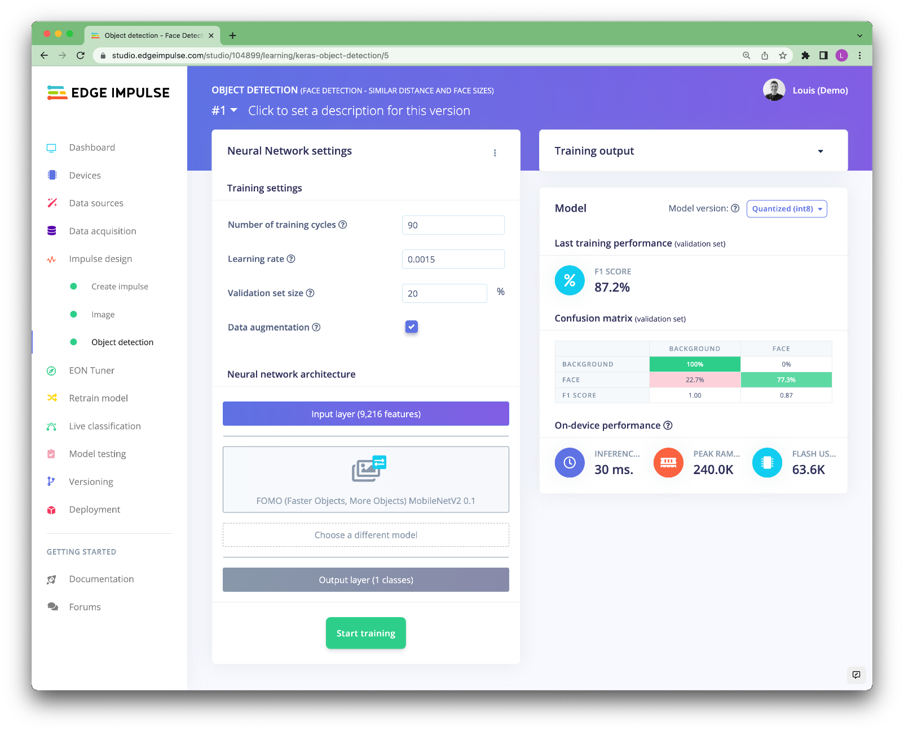

### Validate your model using your test dataset

With the model trained we can try it out on some test data. When we collected our images, we split the data up between a training and a testing dataset. The model was trained only on the training data, and thus we can use the data in the testing dataset to validate how well the model will work on data that has been unseen during the training.

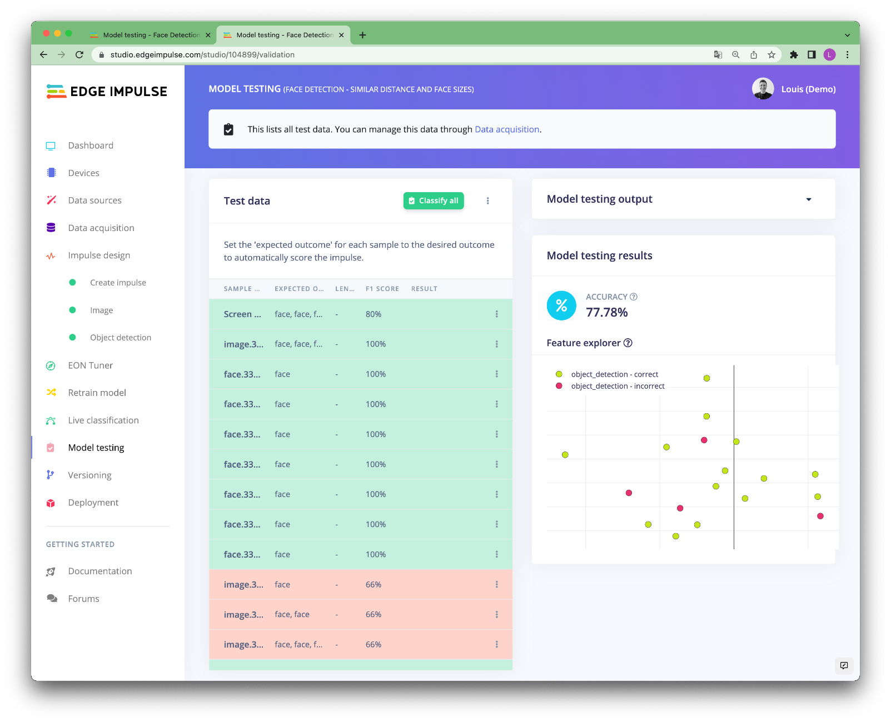


## Connecting the Vision Shield - LoRa® to TTN

To be able to use the LoRa® functionality, we need to first update the firmware on the LoRa® modem. This can be done through Arduino IDE by running a sketch included in the examples from the MKRWAN library.

There is a tutorial on Arduino's documentation website to connect your Portenta to TTN: [https://docs.arduino.cc/tutorials/portenta-vision-shield/connecting-to-ttn](https://docs.arduino.cc/tutorials/portenta-vision-shield/connecting-to-ttn)

Once you have successfully sent your first payload from the Arduino Portenta H7 to TheThingsNetwork, we are going to use OpenMV IDE and start writing our custom business logic.

## Embedded firmware

Now that your LoRa modem is updated and your TTN application is set up, we can write our custom business logic.
Although we can write all the code in Arduino, we've chosen to use OpenMV IDE to do so. OpenMV IDE easily enables the video display which will help us to debug the application as we write it.

To download the OpenMV firmware, go to the **Deployment** tab in Edge Impulse studio and select the **OpenMV Firmware**:

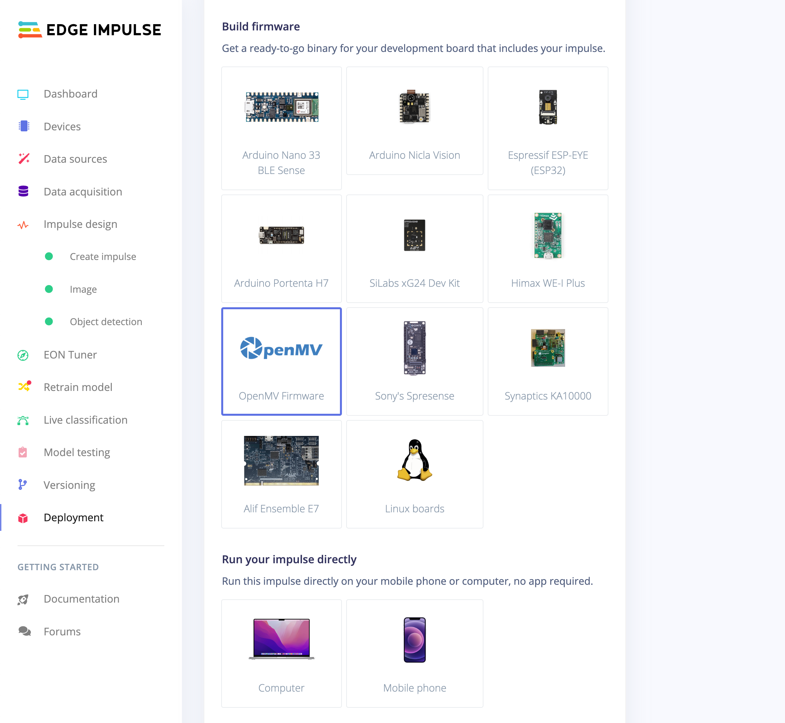

Save the generated .zip file and flash your Portenta with it:

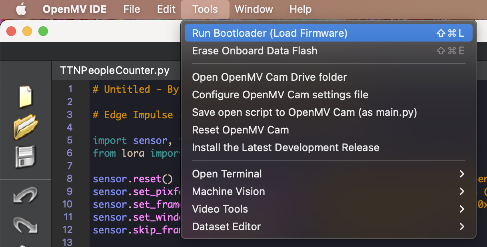

Select the `..._firmware_arduino_portenta.bin` firmware in your extracted .zip file and click on **Run**:

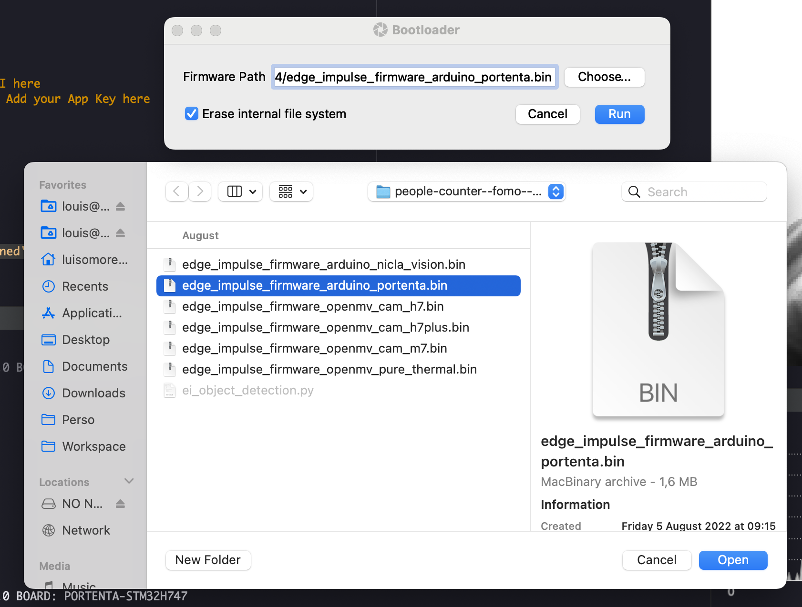

More info on the Edge Impulse documentation web page: [OpenMV deployments](https://docs.edgeimpulse.com/docs/deployment/running-your-impulse-openmv)

Now feel free to have a look at the provided `ei_object_detection.py` example to get a good understanding of how object detection is performed.

Now create a new file, such as `TTNPeopleCounter.py` and copy-paste the following code:


```
# Untitled - By: luisomoreau - Thu Aug 4 2022

# Edge Impulse - OpenMV Object Detection Example

import sensor, image, time, os, tf, math, uos, gc
from lora import *

sensor.reset()                         # Reset and initialize the sensor.
sensor.set_pixformat(sensor.GRAYSCALE)    # Set pixel format to RGB565 (or GRAYSCALE)
sensor.set_framesize(sensor.QVGA)      # Set frame size to QVGA (320x240)
sensor.set_windowing((240, 240))       # Set 240x240 window.
sensor.skip_frames(time=2000)

lora = Lora(band=BAND_EU868, poll_ms=60000, debug=False)       # Let the camera adjust.

print("Firmware:", lora.get_fw_version())
print("Device EUI:", lora.get_device_eui())
print("Data Rate:", lora.get_datarate())
print("Join Status:", lora.get_join_status())

appEui = "0000000000000000" # Add your App EUI here
appKey = "XXXXXXXXXXXXXXXX" # Add your App Key here

net = None
labels = None
min_confidence = 0.5

peopleCounter = 0

try:
    # Load built in model
    labels, net = tf.load_builtin_model('trained')
except Exception as e:
    raise Exception(e)

try:
    lora.join_OTAA(appEui, appKey, timeout=20000)
    # Or ABP:
    #lora.join_ABP(devAddr, nwkSKey, appSKey, timeout=5000)
# You can catch individual errors like timeout, rx etc...
except LoraErrorTimeout as e:
    print("Something went wrong; are you indoor? Move near a window and retry")
    print("ErrorTimeout:", e)
except LoraErrorParam as e:
    print("ErrorParam:", e)

print("Connected.")
lora.set_port(3)

colors = [ # Add more colors if you are detecting more than 7 types of classes at once.
    (255,   0,   0),
    (  0, 255,   0),
    (255, 255,   0),
    (  0,   0, 255),
    (255,   0, 255),
    (  0, 255, 255),
    (255, 255, 255),
]

clock = time.clock()
now = time.ticks_ms()
while(True):
    clock.tick()

    img = sensor.snapshot()

    # detect() returns all objects found in the image (splitted out per class already)
    # we skip class index 0, as that is the background, and then draw circles of the center
    # of our objects

    for i, detection_list in enumerate(net.detect(img, thresholds=[(math.ceil(min_confidence * 255), 255)])):
        if (i == 0): continue # background class
        if (len(detection_list) == 0): continue # no detections for this class?
        peopleCounter=len(detection_list)
        #print("********** %s **********" % labels[i])
        for d in detection_list:

            [x, y, w, h] = d.rect()
            center_x = math.floor(x + (w / 2))
            center_y = math.floor(y + (h / 2))
            #print('x %d\ty %d' % (center_x, center_y))
            img.draw_circle((center_x, center_y, 12), color=colors[i], thickness=2)

    #print(clock.fps(), "fps", end="\n\n")
    #print(peopleCounter, end="\n\n")

    # Send a message every minute
    uplink_interval = 60000

    if time.ticks_ms() - now > uplink_interval:
        print("Sending LoRa payload")
        try:
            # Uplink only
            lora.send_data(peopleCounter.to_bytes(1, 'big'), False)

            # Uplink + downlink request
            #if lora.send_data(peopleCounter.to_bytes(1, 'big'), True):
                #print("Message confirmed.")
            #else:
                #print("Message wasn't confirmed")

        except LoraErrorTimeout as e:
            print("ErrorTimeout:", e)

        # Reset the clock
        now = time.ticks_ms()


    # Read downlink messages
    # Not needed here
    #if (lora.available()):
        #data = lora.receive_data()
        #if data:
            #print("Port: " + data["port"])
            #print("Data: " + data["data"])
    #lora.poll()
```

Make sure to replace your application EUI and KEY with your own:

```
appEui = "0000000000000000" # Add your App EUI here
appKey = "XXXXXXXXXXXXXXXX" # Add your App Key here
```

Et voilà, you are now ready to detect the faces present in front of your camera and forward the counter through LoRaWAN to retrieve it on your TheThingsNetwork application:

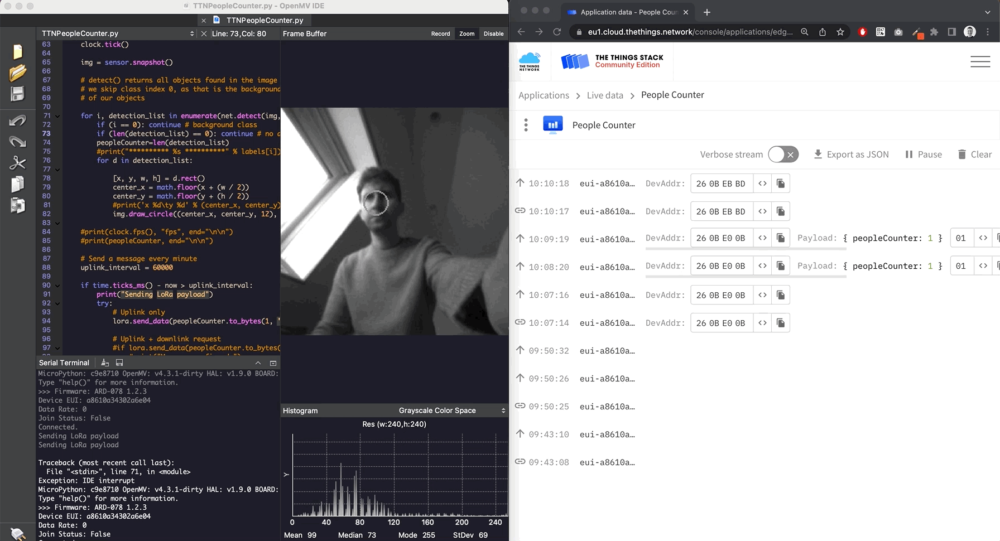